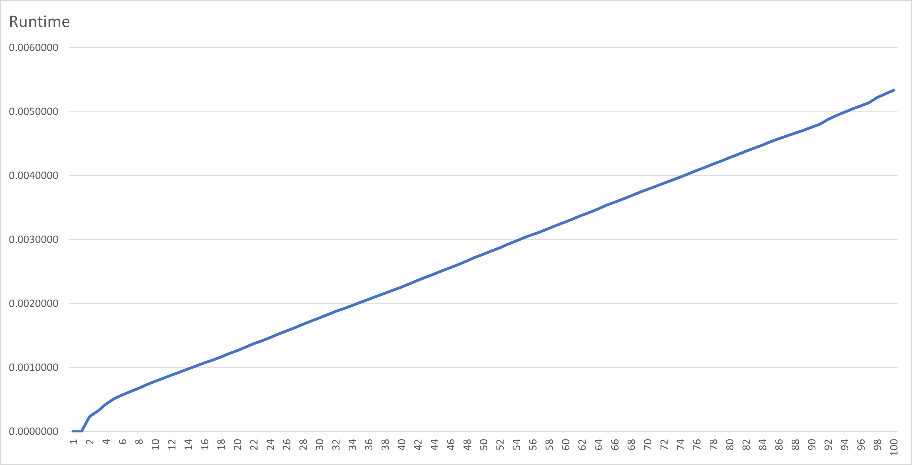
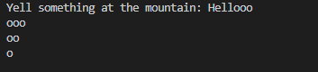
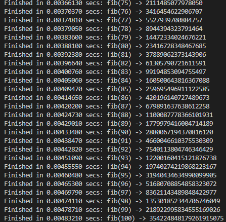

# Assignment 1: Python Refresher
Carlo Velarde

## TOC
* fib.py, echo.py, and an image of the fib plot are in the base of the parent directory.
* misc contains the .csv, .xlsx, and .py files that were used in plotting the data from fib.py. 
* assets contain images of example output of echo.py and fib.py for the Readme.md.

## About 
* This repository is the solution to Assignment 1 for CS:3980. 
* **Echo.py** consists of a method, echo(), that imitate a real-world echo.
* **Fib.py** was used to practice decorators. It has a custom timer decorator
that print the runtime of a decorated function. The timer decorator was used for
the fib() method in order to check its runtime. Fib() is a recursive function, so 
I also used the lru_cache decorator which speeds up run time through memoization.
* **Fib100Chart.jpg** is a jpg image of a chart plotting the runtime of fib given 100 as the input.
* **fib_to_csv.py** is a python script that stores data from fib() and writes it down into a csv file.
   * **fib_execution_times.csv** is the result of running *fib_to_csv.py*
* fib_runtime.xlsx is an Excel file that contains data and the line chart. 

## Fib Visual

## Example output

### echo() 

### fib(10)

### fib(100)
